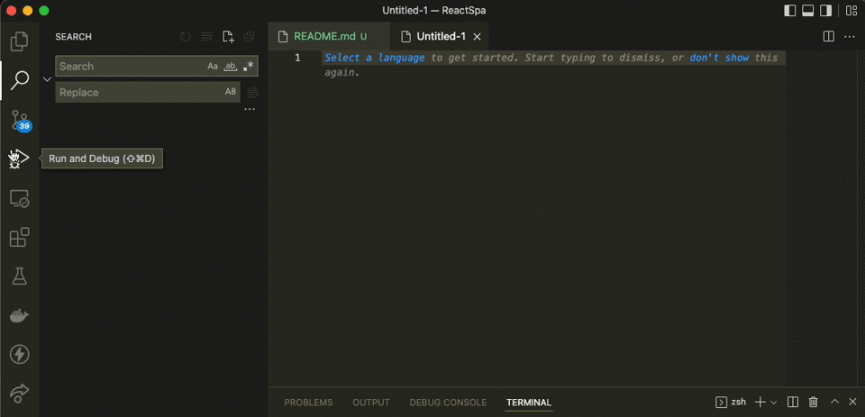
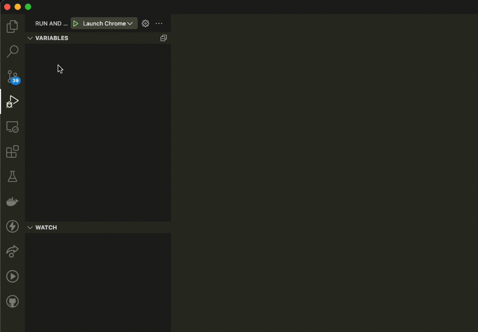

# Debugging React SPA In Visual Studio Code

Below, learn how to quickly debug a React SPA application using Visual Studio Code's build in Javascript Debugger attached to Chrome. 


- Run application using Dotnet (Through IDE or using terminal command `dotnet run`).

- Open the application in a browser to get the HTML page port number (May be optional if the ReactSPA port is not different than the backend port).

- Open the `ClientApp` directory in Visual Studio Code.

- Click `Run and Debug` on the left navigation.

- If you see a dropdown at the top of the Run and Debug pop-out menu, click the gear icon, otherwise click the link that says `create a launch.json file` 

- Once the command prompt appears, click `Chrome`



- The following configuration will allow you to attach to a Chrome instance. Update the URL to reflect the port number of the React application:
```json
{
    // Use IntelliSense to learn about possible attributes.
    // Hover to view descriptions of existing attributes.
    // For more information, visit: https://go.microsoft.com/fwlink/?linkid=830387
    "version": "0.2.0",
    "configurations": [
        {
            "type": "pwa-chrome",
            "request": "launch",
            "name": "Launch Chrome against localhost",
            "url": "https://localhost:44416",
            "webRoot": "${workspaceFolder}"
        }
    ]
}
```

- In the Run and Debug menu on the left, click the drop down at the top and click the item reflecting the name above Launch Chrome against localhost.

- Press the green arrow at the top next to the drop down.

- Note: You will notice that a new Chrome instance opens. Visual Studio Code has attached itself to this and will debug here.



- Place your breakpoints and begin debugging!


Sources:

- Visual Studio JS Debug (Built into Visual Studio Code) https://github.com/microsoft/vscode-js-debug#automatic-browser-debugging
- Debugging ASP.NET Core SPA in Visual Studio Code https://www.dotnetcurry.com/aspnet/1373/debugging-aspnet-core-using-visual-studio-code